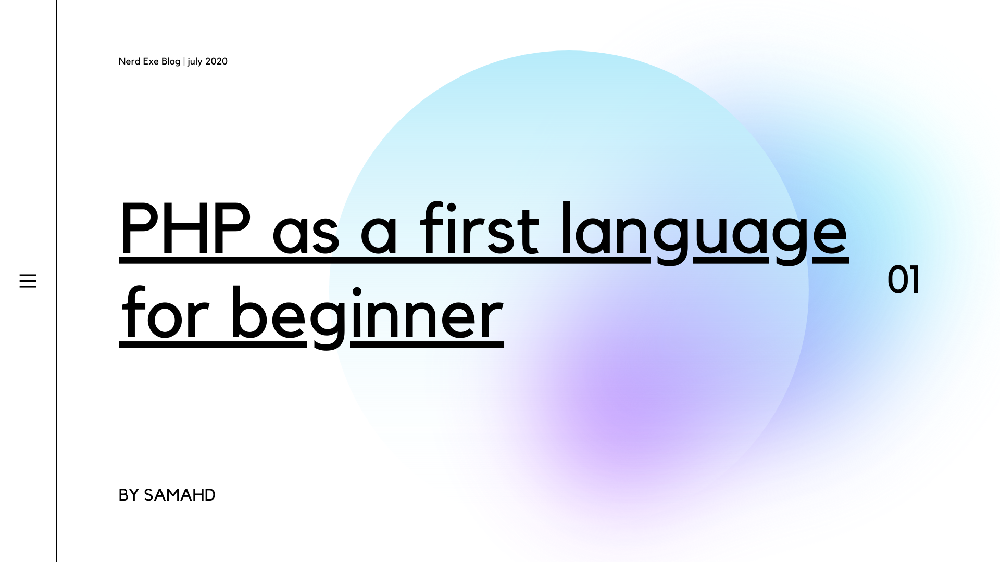

## **Introduction**

Hello world, I would like to start with what php is Incase you don’t know. **PHP** stands for Hypertext Preprocessor. It is a server side language ie it’s a type of language that processes your form when you submit or that redirect when you are not logged in, though a server side language does way more than that.

PHP is actually very simple and beginner friendly and I actually learnt it as my first language but still I wouldn’t recommend it as a first programming language to learn.

**What does not make a good first language**

1. Language with complex and long syntax
2. Writing very long code for everything
3. Hard concepts like C’s pointers
4. Statically typed.

Etc

The above are traits of a bad beginner first language unless you have a super interest in learning coding like me you can opt for a language like c, c++ etc thathas this traits. Else you’ll loose the little interest you have left.

##### What makes a good language

1. Short and easy syntax like php
2. Write short codes for simple tasks and not too long code for complex tasks
3. Simple concepts
4. Dynamically types ie declaring a variable without specifying whether it’s a string, float, Boolean etc.

The above are attributes of a good beginner first language and guess what PHP has all these attributes and even more. Then why did I say it’s bad?

##### Why PHP is great as a first language for beginner

People often have poor decisions in the past, such as enabling magic quotes (which automatically escape post, get and cookie vars with backslashes, sometimes leading to confusion) and register globals (get, post, cookie and some other vars get automatically registered on the global scope) by default. These two are also often used as general attacks on PHP – which I really don’t understand. Sure, they aren’t exactly good things, but you can disable them.

Some also say that PHP’s builtin functions don’t really follow any conventions, which is not true at all. It may not follow a specific convention 100% strictly, but it does not make it a worse language as it’s more than enough similar for most parts.

\
Most often said, People say it is very easy to write bad codes in PHP, I totally agree with that but what’s bad in writing bad codes if you are just a beginner 🤷‍♂️. I highly recommend learning php. It’ll simple make you more interested in programming and set you up for languages you’ll be considering in the future.

\
**PHP is just perfect for you**

With the points made, I would say PHP is definitely a perfect language for beginners looking to get into web development/programming.

PHP is not a complex language, not even close to complex. It’s quite easy to use and understand, but it still has the features of a “real” programming language like Object Oriented Programming. It can be an easy beginner’s language, but it also provides you room for learning new things.

PHP has a *huge* library of built in functions and classes that make almost all tasks very easy to do. Read the contents of a file? Sure – $myvar = file_get_contents(‘myfile.txt’); – Now, do it in C…

And thanks to the above points and the fact that you can embed PHP in HTML, it’s very easy to make something that you can feel proud of. Just throw together some HTML and PHP, host it and you can show everyone what cool stuff you’ve made.

And finally, PHP is a very popular language! If you learn PHP, you can be sure that you can find employment coding it as above 70% web apps run php as backend and it’s been used by tech moguls like Facebook, yahoo, wordpress etc.

##### Conclusion

Don’t let anyone mislead you, if you’re considering web development, PHP is your guy, you can learn online or hire a guy like me to reach you. For feed back or questions. Email me at samahd626@gmail.com. Thanks for reading and best of luck with your career.